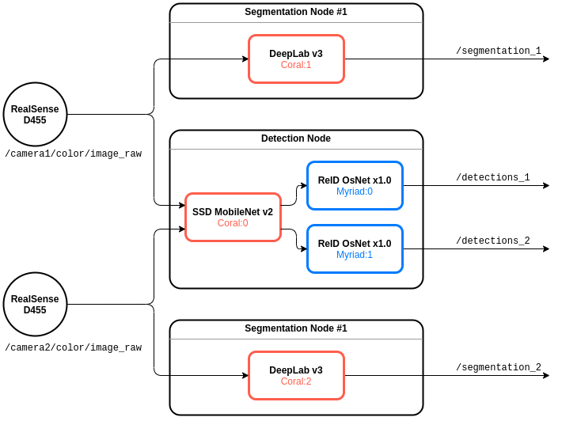

# Overview

This demo shows the simultaneous processing of five neural networks running on hardware accelerators for processing input video streams from two cameras. For each video stream, image segmentation is performed using a [DeepLabV3](https://github.com/tensorflow/models/tree/master/research/deeplab), as well as object detection using a [SSD_Mobilenet_v2](https://aihub.cloud.google.com/p/products%2F79cd5d9c-e8f3-4883-bf59-31566fa99e49), and for each detected person, its identifier is determined using [ReID OsNet](https://github.com/KaiyangZhou/deep-person-reid).



*Detection node*  runs SSD MobileNet inference for object detection and double OsNet for person reidentification.

*Segmentation node* runs DeepLabV3 for segmentation. This node runs in duplicate.

# Installation

## Check your edge AI devices

For this demo, 5 devices are used: three myriads and two corals.

The presence of myriads in the system can be checked using the command:
```
lspci -d 1B73:1100
```

The presence of corals in the system can be checked using the command:
```
lspci -d 1AC1:089A
```

## Clone and install all dependencies

It is highly recommended to run everything inside a docker container(*TODO LINK!!!*).

```
sudo apt install -y python-rosdep
cd <your_ws>/src
git clone --recursive https://github.com/FastSense/edge_ai_demo.git
cd ..
rosdep install --from-paths src --ignore-src -r -y
pip3 install nnio
```

## Build your workspace

```
cd <your_ws>
catkin_make
source <your_ws/>/devel/setup.bash
```

# Quick start

## Setting up cameras
### RealSense setup

Open `desktop_demo/launch/demo.launch`. Check the serial numbers of your cameras and write them down to the launch file:
```
<arg name="serial_no_camera1" default="XXXXXXXXXXXX"/>
<arg name="serial_no_camera2" default="XXXXXXXXXXXX"/>
```
### Other cameras setup

If you use any other cameras, you will need to independently launch within ROS and specify the names of the topics where they publish the images in the launch file `desktop_demo/launch/demo.launch`.

```
<arg name="camera1_topic" default="/set_your_topic_name_here"/>
<arg name="camera2_topic" default="/set_your_topic_name_here"/>
```

And then set flag `launch_realsense` to `false`:

```
<arg name="launch_realsense" default="false"/>
```

## Run the demo
All that's left now is to launch the launch file `demo.launch`:
```
roslaunch desktop_demo demo.launch
```

And then open [http://localhost:8888/](http://localhost:8888/) on your device. You will see the result of the networks in four frames, as in the overview.

# Interface

## Detection Node

### Parameters

*/\<name>/in_img_topics (string, default: "/camera1/color/image_raw")*

&nbsp;&nbsp;&nbsp;&nbsp;

*/\<name>/out_img_topics (string, default: "/camera1/color/image_raw")*

&nbsp;&nbsp;&nbsp;&nbsp;

*/\<name>/detection_inference_framework (string, default: "/camera1/color/image_raw")*

&nbsp;&nbsp;&nbsp;&nbsp;Framework for detection inference: *`"ONNX"`*, *`"OPENVINO"`* or *`"EDGE_TPU"`*.

*/\<name>/detection_inference_device (string, default: "/camera1/color/image_raw")*

&nbsp;&nbsp;&nbsp;&nbsp;Device name for SSD Mobilenet inference. Device for the inference. For OpenVINO: *`"CPU"`, `"GPU"` or `"MYRIAD"`*. EdgeTPU: *`"TPU:0"`* to use the first EdgeTPU device, *`"TPU:1"`* for the second etc...

*/\<name>/reid_inference_framework (string, default: "/camera1/color/image_raw")*

&nbsp;&nbsp;&nbsp;&nbsp;Framework for inference: *`"ONNX"`*, *`"OPENVINO"`* or *`"EDGE_TPU"`*.

*/\<name>/reid_inference_device (string, default: "/camera1/color/image_raw")*

&nbsp;&nbsp;&nbsp;&nbsp; Device name for ReID inference. Device for the inference. For OpenVINO: *`"CPU"`, `"GPU"` or `"MYRIAD"`*. EdgeTPU: *`"TPU:0"`* to use the first EdgeTPU device, *`"TPU:1"`* for the second etc...

*/\<name>/reid_model_path (string, default: "/camera1/color/image_raw")*

&nbsp;&nbsp;&nbsp;&nbsp;URL or path to reID model (only for `.xml` for OpenVINO, `.tflite` for Corals, `.onnx` for ONNX).

*/\<name>/reid_bin_path (string, default: "/camera1/color/image_raw")*

&nbsp;&nbsp;&nbsp;&nbsp;URL or path to reID model binary (only for OpenVINO).

*/\<name>/threshold (float, default: 0.7)*

&nbsp;&nbsp;&nbsp;&nbsp;Theshold for person reidentification. The higher, the earlier two different persons will be considered two different persons.

*/\<name>/max_inference_rate (float, default: 20.0)*

&nbsp;&nbsp;&nbsp;&nbsp;

### Subscribed topics

*/\<in_img_topics[i]> ([sensor_msgs/Image](https://docs.ros.org/en/melodic/api/sensor_msgs/html/msg/Image.html))*

&nbsp;&nbsp;&nbsp;&nbsp;Topic with input image frame. Name of the topics spicified in `/<name>/in_img_topics`.

### Published topics

*/\<out_img_topics[i]> ([sensor_msgs/Image](https://docs.ros.org/en/melodic/api/sensor_msgs/html/msg/Image.html))*

&nbsp;&nbsp;&nbsp;&nbsp;Topic where images are published with found objects marked on it. Name of the topics spicified in `/<name>/out_img_topics`.

## Segmentation Node

### Parameters
*/\<name>/input_topic_name (string, default: "/camera1/color/image_raw")*

&nbsp;&nbsp;&nbsp;&nbsp;The name of the input topic.

*/\<name>/output_topic_name (string, default: "/segmentation")*

&nbsp;&nbsp;&nbsp;&nbsp;The name of the output topic.

*/\<name>/inference_framework (string, default: "EDGETPU")*

&nbsp;&nbsp;&nbsp;&nbsp;Framework for inference: *`"ONNX"`*, *`"OPENVINO"`* or *`"EDGE_TPU"`*.

*/\<name>/inference_device (string, default: "TPU")*

&nbsp;&nbsp;&nbsp;&nbsp;Device for the inference. For OpenVINO: *`"CPU"`, `"GPU"` or `"MYRIAD"`*. EdgeTPU: *`"TPU:0"`* to use the first EdgeTPU device, *`"TPU:1"`* for the second etc...

*/\<name>/max_inference_rate (float, default: 10.0)*

&nbsp;&nbsp;&nbsp;&nbsp;Max Inference rate.

### Subscribed topics

*/\<input_topic_name> ([sensor_msgs/Image](https://docs.ros.org/en/melodic/api/sensor_msgs/html/msg/Image.html))*

&nbsp;&nbsp;&nbsp;&nbsp;Topic with input image frame. Name of the topic spicified in `/<name>/input_topic_name`.

### Published topics

*/\<output_topic_name> ([sensor_msgs/Image](https://docs.ros.org/en/melodic/api/sensor_msgs/html/msg/Image.html))*

&nbsp;&nbsp;&nbsp;&nbsp;Topic where images are published with found objects segmented on it. Name of the topic spicified in `/<name>/output_topic_name`.